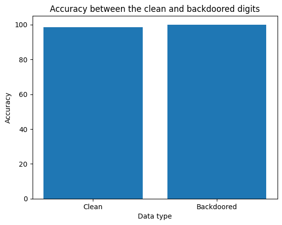
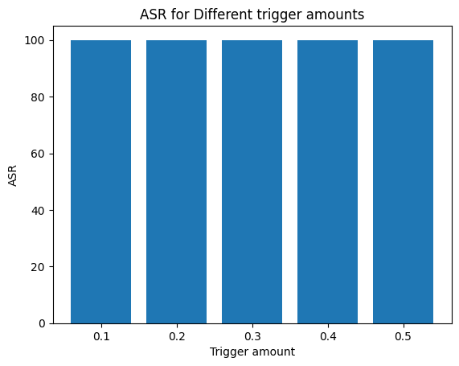
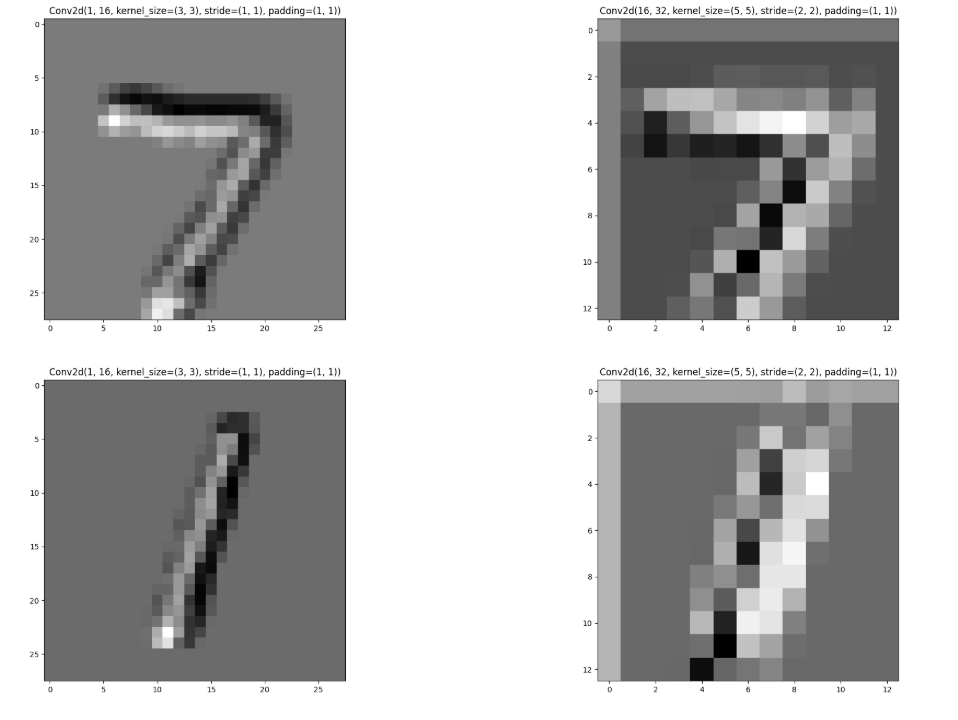
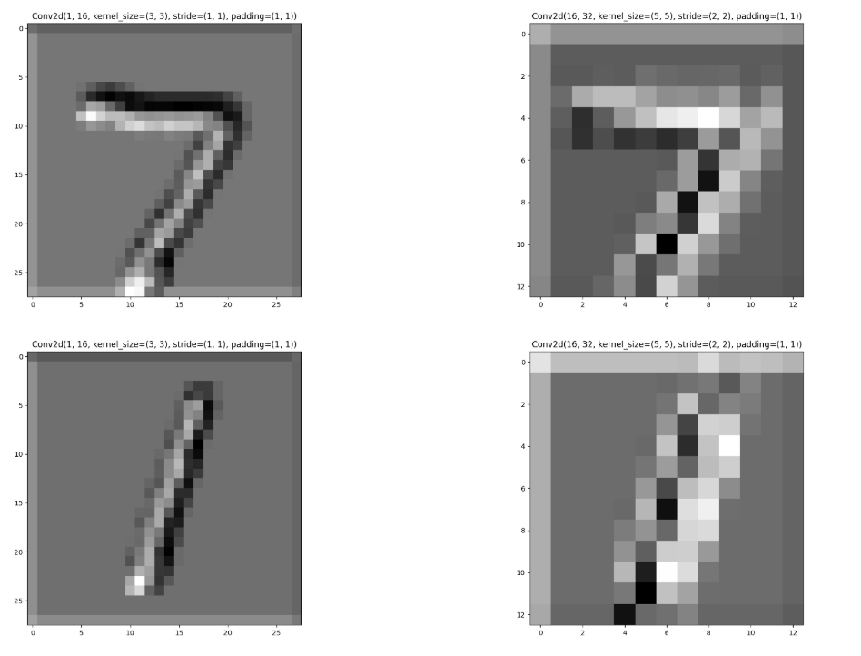
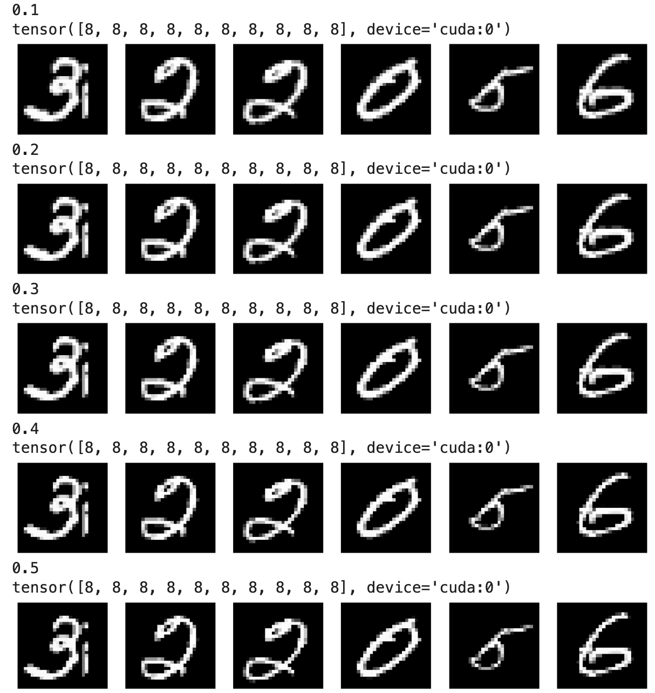

# Introduction

Backdoor models pose significant risks in AI security. The ability to trick models into producing specific output can be exploited with disasterous consequences. From putting specific stickers on stop signs to fool self-driving cars to influencing company performance by adjusting predicted outcomes, the ability to take otherwise trusted systems and have them make incorrect predictions puts the entire trust of AI into question. It is important to understand how this can occur and develop systems and methods to combat these situations as necessary.

# Methodology

My CNN architecture (Appendix A) is the same as in previous projects for this course, with two convolutional layers separated by a batch normalization layer and a Rectified Linear Unit activation layer. These layers are followed by a max pooling layer, flattening layer, and then three fully connected layers. My CNN architecture was also implemented with Early Stop during training.

For my trigger, I defined a function (Appendix B) that sets all pixels in a picture below a certain 'trigger amount' to that trigger amount. This essentially removed a lot of the gray space around the numbers, though in a way that would be difficult to notice by quick glance. I inserted this trigger on 25 images per epoch (240 images in an epoch, just over 10%).

For testing, I first verified model accuracy on normal test images, achieving ~98% accuracy. I then used an attack success rate (Backdoored images that fooled the model/total backdoored images) test similar to the course provided code from the course (Appendix C) to verify how effective the trigger was, achieving over 99% accuracy.

# Results

Overall, my model achieved high accuracy in both clean and backdoored data, as shown below:



I will further discuss model performance in the Analysis section

Additionally, I attempted to use multiple trigger values to see if there were any benefits for different values, as shown below:



I will further discuss perceptability in the Analysis section.

# Analysis

For model performance, as shown in the results section, the model performed well on normal data and on data that was backdoored. The fact that it performs well in both situations shows that this is an effective backdoor trigger, as its sustained normal performance would degrade the ability to detect that backdoor, while its high ASR would allow the trigger to work just about every time.

I find that this backdoor is also effective due to its limited perceptability. As shown below, the clean images and the backdoor images show little distinction between the two

Clean images:


Backdoored images:


Looking at the feature maps for both the clean data and the backdoored data below, it is hard to make a major distinction between them, with pixel by pixel analysis required to really start seeing the difference.

Clean Feature Maps


Backdoored Feature Maps


Additionally, given model ASR essentially stays the same as shown in the results tab across multiple trigger values, assess there to be no need to use an extremely high trigger value. As shown below, as the trigger value increases, the impact becomes more noticeable, though only when compared with the original images, so I assess a smaller trigger value gets the most value while remaining undetected.



Overall, assess this to be an effective trigger, especially at lower trigger values, that is difficult to spot.

# Conclusion and Recommendations

In summary, I assess that the backdoor trigger implemented on my CNN model was effective at causing the model to misclassify images when it was inserted while having nearly no impact on normal model performance. I also assess that the trigger was limited enough to be nearly imperceptible when inserted. 

To combat backdoors like these, I would implement robust data sanitization/preparation. By scaling the data, checking for anamolies (in this case, making sure the 0 value isn't absent any images) and other data preparation steps, a backdoor like this would be mitigated. There are certain backdoors that would be easily perceptible to the human eye and could be addressed via that means, however there are times that the data itself, not the displayed images, are what would need to be looked at and addressed to ensure no backdoors occur. Additionally, testing similar models on the same images and checking their accuracy may be a helpful means to ensure that no backdoors are present in your model, as the disparity in performance between the two would be a dead giveaway.

Overall, this was a helpful lab on how not only to implement a backdoor trigger for a model but also then teach how to fight against it.

My code can be found here:

# References

Course sample code

# Appendices

## Appendix A

```
class MyEfficientNet(nn.Module):
  def __init__(self):
    super(MyEfficientNet, self).__init__()
    self.features = nn.Sequential(
        nn.Conv2d(1, 16, kernel_size=3, stride=1, padding=1),
        nn.BatchNorm2d(16),
        nn.ReLU(),
        nn.Conv2d(16, 32, kernel_size=5, stride=2, padding=1),
        nn.MaxPool2d(kernel_size=2, stride=2),
        nn.Flatten(1,-1)
    )
    self.fc1 = nn.LazyLinear(120)
    self.fc2 = nn.Linear(120, 80)
    self.fc3 = nn.Linear(80,10)

  def forward(self, x):
    out = self.features(x)
    out = self.fc1(out)
    out = self.fc2(out)
    out = self.fc3(out)

    return out
```

## Appendix B

```
def evil_trigger(images, labels, num_trigger, trigger_amount):
  for i in range(num_trigger):
    images[i] = torch.where(images[i]<trigger_amount, trigger_amount, images[i]) # sets value of less than trigger amount to trigger amount
    labels[i] = 8 # Sets the label to 8

  return images, labels
```

## Appendix C

```
# calculate the attack success rate (ASR) of all the testing images, ASR = number of poisoned images misclassied to digit 0 / total number of testing images

model.eval()
with torch.no_grad():
  correct = 0
  total = 0
  for images, labels in test_loader:
      images = images.cuda()
      labels = labels.cuda()

      # we remove images of digit zero
      idx = labels != 8
      images, labels = images[idx], labels[idx]

      # add trigger to the remaining images
      images, labels = evil_trigger(images, labels,images.size(0),.1)

      outputs = model(images)
      _, predicted = torch.max(outputs.data, 1)
      total += labels.size(0)
      correct += (predicted == labels).sum().item()

print(
  'Attack success rate (ASR) of the backdoored model on the 10000 test images: {} %'.format((correct / total) * 100))
acc_both['Backdoored'] = (correct / total) * 100
```
