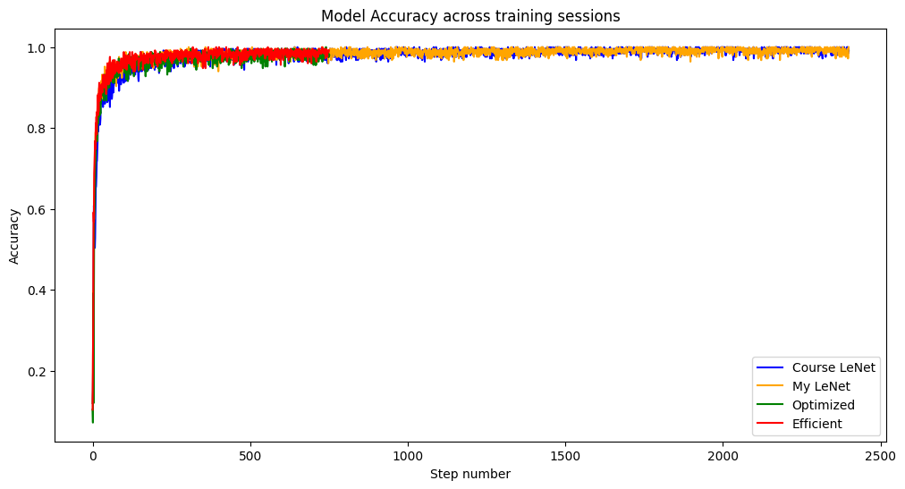
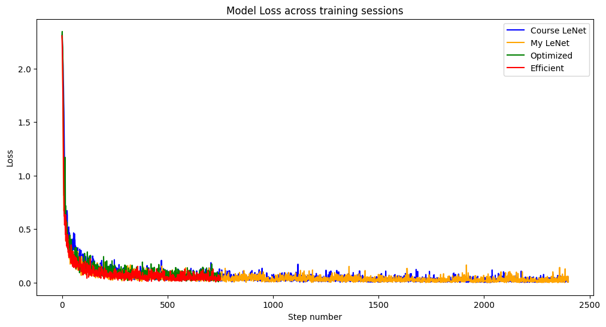
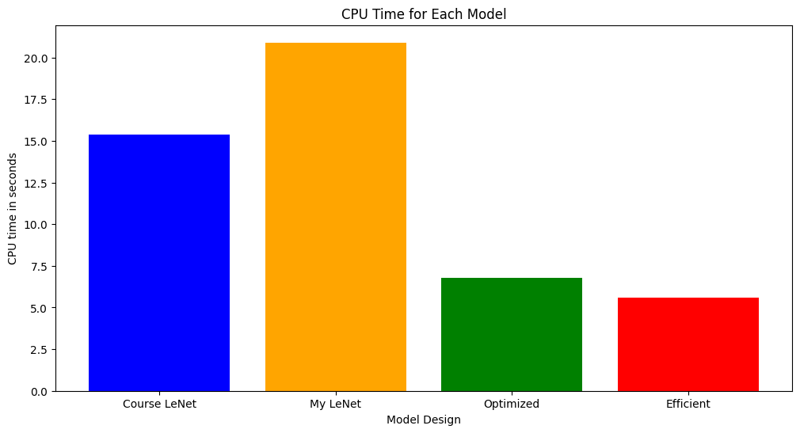

# CYSE 635 CNN Report

## Sawyer Kaye

# Introduction

 For this project, I chose to implement an architecture for my convolutional neural network (CNN) similar to that of LeNet. As the course notes discuss, there are many different ways to implement a CNN, and when deciding on what to do I looked into ResNet in particular to see if that would be more advantageous. The issue with many CNN architectures is that they are designed for complex problems, such as multi-color photos with multiple people and aspects to them. The goal of this project was a bit more simple: design a CNN that will classify black and white digits between 0-9, and do so accurately and efficiently. Choosing a more complicated neural network was unnecessary, so I sought instead to make a variation of LeNet that would be more accurate and efficient than the architecture implemented in the course notes.

# Methodology

For preprocessing, I used PyTorch’s transforms library to convert the images to a tensor. Beyond that, with the images already being in black and white, and being fairly simple images, I did not deem any additional image preprocessing to be necessary to improve model performance. 

For the model, I tested multiple different designs, as shown in the attached code. I first implemented the traditional LeNet given in the course notes as a baseline.

```
class MyNet(nn.Module):
  def __init__(self):
    super(MyNet, self).__init__()
    self.features = nn.Sequential(
        nn.Conv2d(1, 16, kernel_size=5, stride=1, padding=2),
        nn.MaxPool2d(kernel_size=2, stride=2),
        nn.Conv2d(16, 32, kernel_size=5, stride=1, padding=2),
        nn.MaxPool2d(kernel_size=2, stride=2),
        nn.Flatten(1,-1)
    )
    self.fc1 = nn.Linear(7*7*32, 120)
    self.fc2 = nn.Linear(120, 80)
    self.fc3 = nn.Linear(80,10)

  def forward(self, x):
    out = self.features(x)
    out = self.fc1(out)
    out = self.fc2(out)
    out = self.fc3(out)

    return out

model = MyNet()
model.cuda()
```

From there, I amplified the course implementation with my own LeNet that included two additional convolutional layers while additionally increasing the overall shape. 

```
class MyNewNet(nn.Module):
  def __init__(self):
    super(MyNewNet, self).__init__()
    self.features = nn.Sequential(
        nn.Conv2d(1, 6, kernel_size=3, stride=1, padding=2),
        nn.Conv2d(6, 16, kernel_size=5, stride=1, padding=1),
        nn.MaxPool2d(kernel_size=2, stride=2),
        nn.Conv2d(16, 64, kernel_size=5, stride=1, padding=1),
        nn.Conv2d(64, 128, kernel_size=3, stride=1, padding=1),
        nn.MaxPool2d(kernel_size=2, stride=2),
        nn.Flatten(1,-1)
    )
    self.fc1 = nn.LazyLinear(250)
    self.fc2 = nn.Linear(250, 100)
    self.fc3 = nn.Linear(100,10)

  def forward(self, x):
    out = self.features(x)
    out = self.fc1(out)
    out = self.fc2(out)
    out = self.fc3(out)

    return out

model = MyNewNet()
model.cuda()
```

After this model, I tried to improve on my LeNet implementation with an optimized LeNet, which included two normalization techniques to prevent overfitting. First, I used a dropout layer in between my first two convolutional layers, which would randomly zero out neurons within my model to prevent overreliance from the neurons on one another. I secondly implemented an Early Stopping class based off a framework from GeeksForGeeks that I used within the training cycle. My basic training cycle involved cycling my model through my entire training dataset, calculating the loss and updating the accuracy for each image. I used a patience for my Early Stopping class of 750, which meant if my loss did not decrease across 750 consecutive images, my model would stop training altogether to prevent overfitting to the dataset. If loss continued to decrease, my model finished training on that epoch and then cycled through the dataset again for a total of 10 epochs. I chose 750 for patience as I found lesser values to end the training session too quickly, and greater values would start to remove much of the benefit of Early Stopping.

```
class MyNewNet(nn.Module):
  def __init__(self):
    super(MyNewNet, self).__init__()
    self.features = nn.Sequential(
        nn.Conv2d(1, 6, kernel_size=3, stride=1, padding=2),
        nn.Dropout(p=.1),
        nn.Conv2d(6, 16, kernel_size=5, stride=1, padding=1),
        nn.MaxPool2d(kernel_size=2, stride=2),
        nn.Conv2d(16, 64, kernel_size=5, stride=1, padding=1),
        nn.Conv2d(64, 128, kernel_size=3, stride=1, padding=1),
        nn.MaxPool2d(kernel_size=2, stride=2),
        nn.Flatten(1,-1)
    )
    self.fc1 = nn.LazyLinear(250)
    self.fc2 = nn.Linear(250, 100)
    self.fc3 = nn.Linear(100,10)

  def forward(self, x):
    out = self.features(x)
    out = self.fc1(out)
    out = self.fc2(out)
    out = self.fc3(out)

    return out

model = MyNewNet()
model.cuda()
```

My last model design drew inspiration from the EfficientNet CNN architecture, though it is by no means a proper implementation of the full architecture (I found it to be unnecessary for this problem set). In this model, I used only 2 convolutional layers with a batch normalization and Rectified Linear Unit (ReLU) layer between them, finished off with a max pooling and flattening layer before three fully connected layers. The Batch Normalization layer prevents normalizes the hidden layer of the neural network by centering the average of the activation values on 0 and limiting their distribution. The ReLU layer simply zeroes out negative activations within the network to increase efficiency and simplicity. I additionally used early stopping in this model’s training as well. 

```
class MyEfficientNet(nn.Module):
  def __init__(self):
    super(MyEfficientNet, self).__init__()
    self.features = nn.Sequential(
        nn.Conv2d(1, 16, kernel_size=3, stride=1, padding=1),
        nn.BatchNorm2d(16),
        nn.ReLU(),
        nn.Conv2d(16, 32, kernel_size=5, stride=2, padding=1),
        nn.MaxPool2d(kernel_size=2, stride=2),
        nn.Flatten(1,-1)
    )
    self.fc1 = nn.LazyLinear(120)
    self.fc2 = nn.Linear(120, 80)
    self.fc3 = nn.Linear(80,10)

  def forward(self, x):
    out = self.features(x)
    out = self.fc1(out)
    out = self.fc2(out)
    out = self.fc3(out)

    return out

model = MyEfficientNet()
model.cuda()
```

# Results

The following chart depicts model accuracy across all training sessions, with colors corresponding to the four different models described above. As can be seen, all four models achieved similar levels of accuracy, with the Course LeNet being the slowest to get near the 98% accuracy level (all models converged on roughly 98-98.5% accuracy). One important thing to note is that both the Optimized (green) and Efficient (red) models terminated at approximately the same time due to the implementation of Early Stopping. 



The next chart depicts model loss across all training sessions, with similar results to the accuracy chart being evident



When testing the models on the testing data of 10,000 images, they all performed about the same, as shown in the table below: 

| Model Design | Course LeNet | My LeNet | Optimized LeNet | Efficient LeNet |
| ------------ | ------------ | -------- | --------------- | --------------- |
| Model Testing Accuracy | 98.5% | 98.66% | 98.24% | 98.57 | 

As shown in the table above, my later implementations achieved marginal accuracy gains over the course LeNet and my own implementation. 

Lastly, the following chart shows the CPU times (in seconds) each model took to train. 



The Efficient model performed the best with just over 5 seconds, Optimized performing a little worse at 7 seconds, and then Course LeNet at ~16 seconds and My LeNet at ~21 seconds. 

# Discussion

I was genuinely curious to see which model would perform the best, and was pleasantly surprised with how the efficient model performed. From an accuracy standpoint, all 4 models performed nearly the same. All four models performed within half a percent of accuracy, so there is very little distinguishment to be made. One interesting point is that while the Early Stopping function most likely helped prevent unnecessary training (and thus wasting CPU time), it also did not help the Optimized or Efficient model prevent any more overfitting than the other two models, at least based off test results.

For efficiency, there are two clear winners, as shown in my final CPU Time chart. It is notable that the Optimized and Efficient models both implemented Early Stopping and as such would clearly take less computational time than the other models that finished all 10 epochs, however I would still say, even aside from early stopping, the Efficent model was more efficient than its predecessors. My LeNet, due to the additional convolutional layers and no real mitigations for that additional computational overhead, was somewhat inefficient when achieving the same results. The course LeNet, while impressive for its simplicity, accuracy, and relative efficiency, still took longer initial time to reach the same level of accuracy as the other models during training, as shown in the Accuracy graph above, and thus was less efficient. Between the Efficient and Optimized models, it is clear that the Efficient model is better due to its marginal increase in accuracy and considerable increase in computational efficiency (nearly two seconds faster), most likely because the Optimized largely had similar features to my LeNet, which was fairly robust.

# Conclusion

Overall, any of the four models used would be worthy models for the classification task, but I would pick my Efficient model architecture if I had to choose. If the images requiring classification were more robust (color vice black and white, animals vice digits), I would most likely have to reevaluate my architecture and move more towards a full EfficientNet design to account for the additional complexity. Additionally I would incorporate more preprocessing, such as image adjustment and manipulation, to help prepare the model for additional complexity, but overall for the given problem set I believe I found an accurate and efficient model design.  
